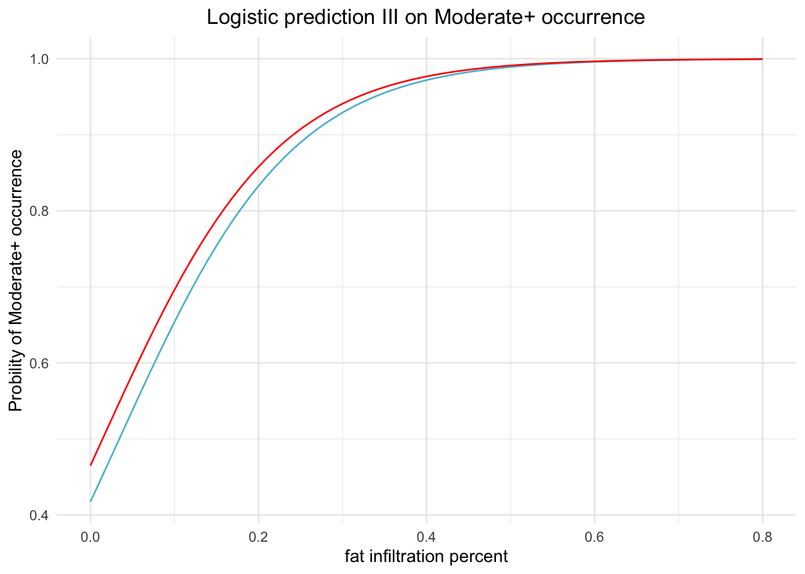

# MRI characteristics and DUX4 molecular signatures {#MRI-vs-DUX4-score}

- Address the association of MRI characteristics to DUX4 signatures  
- Two approaches to determine the DUX4 signature occurrences: (1) threshold of DUX4 score--accumulated $\log_{10}(TPM+1)$ over six robust DUX4 genes, and (2) prediction by the training model (DUX4-M6) built upon the longitudinal study and random forest  
- Apply logistics regression using a linear combination of STIR status and fat infiltration percent and outcome of DUX4 expression occurrence. Output the logistics regression as a function. 


## STIR status and DUX4 signatures


<table>
<caption>(\#tab:dux4-score-summary)Mean values of DUX4 scores (based on DUX4-M6 basket) in STIR+ and STIR- biopsies.</caption>
 <thead>
  <tr>
   <th style="text-align:left;"> STIR_status </th>
   <th style="text-align:right;"> m </th>
  </tr>
 </thead>
<tbody>
  <tr>
   <td style="text-align:left;"> STIR+ </td>
   <td style="text-align:right;"> 3.0286217 </td>
  </tr>
  <tr>
   <td style="text-align:left;"> STIR- </td>
   <td style="text-align:right;"> 0.4073134 </td>
  </tr>
</tbody>
</table>
The mean difference of DUX4 scores in STIR+ and STIR- groups is significantly greater than 0 with Wilcox $p$-value $7e-10$. 


```
#> 
#> 	Wilcoxon rank sum exact test
#> 
#> data:  dux4_list[[1]] and dux4_list[[2]]
#> W = 815, p-value = 7.315e-10
#> alternative hypothesis: true location shift is not equal to 0
```

## Logistics prediction of DUX4 signature occurrence

### Scheme 1: use random forest traning model based on DUX4 M6 basket
The first scheme used the random forest training model built on the longitudinal model with six DUX4 basket genes.
<table>
<caption>(\#tab:use-rf-model)STIR+ and - distribution on the DUX4+/- group.</caption>
 <thead>
  <tr>
   <th style="text-align:left;"> STIR_status </th>
   <th style="text-align:right;"> DUX4- </th>
   <th style="text-align:right;"> DUX4+ </th>
  </tr>
 </thead>
<tbody>
  <tr>
   <td style="text-align:left;"> STIR+ </td>
   <td style="text-align:right;"> 1 </td>
   <td style="text-align:right;"> 21 </td>
  </tr>
  <tr>
   <td style="text-align:left;"> STIR- </td>
   <td style="text-align:right;"> 11 </td>
   <td style="text-align:right;"> 26 </td>
  </tr>
</tbody>
</table>

```
#> # A tibble: 2 × 4
#>   rfM6_fit average_DUX4_score min_DUX4_score max_DUX4_score
#>   <fct>                 <dbl>          <dbl>          <dbl>
#> 1 Control              0.0417         0.0260         0.0668
#> 2 FSHD                 1.74           0.0856         6.05
```


The general linear model depicted that STIR status was key to the association to DUX4 signatures whereas fat infiltration or fraction presented less solid evident of direct association (p-value=0.3).

The code chunk below applies the logistic regression using a fat infiltration percent and STIR status as predictors and outcome of DUX4 signature occurrence predicted by random forest:

```
#> 
#> Call:
#> glm(formula = rfM6_fit ~ Fat_Infilt_Percent + STIR_status, family = "binomial", 
#>     data = data)
#> 
#> Deviance Residuals: 
#>      Min        1Q    Median        3Q       Max  
#> -2.18405   0.04185   0.51973   0.81414   0.96049  
#> 
#> Coefficients:
#>                    Estimate Std. Error z value Pr(>|z|)
#> (Intercept)          0.1377     0.7357   0.187    0.852
#> Fat_Infilt_Percent   8.3965     7.5969   1.105    0.269
#> STIR_statusSTIR+     0.7714     1.2636   0.610    0.542
#> 
#> (Dispersion parameter for binomial family taken to be 1)
#> 
#>     Null deviance: 59.598  on 58  degrees of freedom
#> Residual deviance: 51.047  on 56  degrees of freedom
#> AIC: 57.047
#> 
#> Number of Fisher Scoring iterations: 7
```

<div class="figure" style="text-align: center">

<p class="caption">(\#fig:stir-fat-logit-prediction-rfFit)Prediction of DUX4 signature ocurrence modeled by linear combination of STIR_status and FAT_Infilt_Percent</p>
</div>
 
### Scheme 2: Binary outcome using DUX4 score >1
We use the DUX4 score defined by the accumulated log(TPM+1) over the six genes of the DUX4 basket. Then use whole muscle fat percent and STIR status as predictor to infer the occurrence of DUX4 score > 1. Predictions for 13-0007R and 13-0009R are excluded.
<table>
<caption>(\#tab:scheme2_based_on_DUX4_score)Number of STIR- and STIR+ in the DUX4 <1 and DUX4 > 1 group.</caption>
 <thead>
  <tr>
   <th style="text-align:left;"> STIR_status </th>
   <th style="text-align:right;"> DUX4&lt;1 </th>
   <th style="text-align:right;"> DUX4&gt;1 </th>
  </tr>
 </thead>
<tbody>
  <tr>
   <td style="text-align:left;"> STIR+ </td>
   <td style="text-align:right;"> 4 </td>
   <td style="text-align:right;"> 18 </td>
  </tr>
  <tr>
   <td style="text-align:left;"> STIR- </td>
   <td style="text-align:right;"> 34 </td>
   <td style="text-align:right;"> 6 </td>
  </tr>
</tbody>
</table>

```
#> # A tibble: 2 × 4
#>   `DUX4-M6-logSum-positive` average_DUX4_s…¹ min_D…² max_D…³
#>   <fct>                                <dbl>   <dbl>   <dbl>
#> 1 Control-like                         0.221  0.0260   0.877
#> 2 DUX4+                                3.11   1.25     6.05 
#> # … with abbreviated variable names ¹​average_DUX4_score,
#> #   ²​min_DUX4_score, ³​max_DUX4_score
```

```
#> 
#> Call:
#> glm(formula = `DUX4-M6-logSum-positive` ~ Fat_Infilt_Percent + 
#>     STIR_status, family = "binomial", data = data)
#> 
#> Deviance Residuals: 
#>     Min       1Q   Median       3Q      Max  
#> -2.4808  -0.5815  -0.5307   0.4563   2.0068  
#> 
#> Coefficients:
#>                    Estimate Std. Error z value Pr(>|z|)    
#> (Intercept)         -2.1630     0.5268  -4.106 4.03e-05 ***
#> Fat_Infilt_Percent   4.7570     3.1002   1.534   0.1249    
#> STIR_statusSTIR+     2.0720     0.9138   2.267   0.0234 *  
#> ---
#> Signif. codes:  
#> 0 '***' 0.001 '**' 0.01 '*' 0.05 '.' 0.1 ' ' 1
#> 
#> (Dispersion parameter for binomial family taken to be 1)
#> 
#>     Null deviance: 82.762  on 61  degrees of freedom
#> Residual deviance: 51.438  on 59  degrees of freedom
#> AIC: 57.438
#> 
#> Number of Fisher Scoring iterations: 5
```


### Use logistics to predict the Moderate+ occurrence
The outcome of Moderate+ occurrence is predicted by the random forest built upon 30 basket genes distingusing control and moderate+IG-high+high FSHDs.

<table>
 <thead>
  <tr>
   <th style="text-align:left;"> STIR_status </th>
   <th style="text-align:right;"> cntr-like </th>
   <th style="text-align:right;"> moderate+ </th>
  </tr>
 </thead>
<tbody>
  <tr>
   <td style="text-align:left;"> STIR+ </td>
   <td style="text-align:right;"> 2 </td>
   <td style="text-align:right;"> 20 </td>
  </tr>
  <tr>
   <td style="text-align:left;"> STIR- </td>
   <td style="text-align:right;"> 15 </td>
   <td style="text-align:right;"> 25 </td>
  </tr>
</tbody>
</table>

```
#> # A tibble: 3 × 4
#>   class        avg_DUX4_score min_DUX4_score max_DUX4_score
#>   <fct>                 <dbl>          <dbl>          <dbl>
#> 1 Control-like          0.163         0.0260          0.709
#> 2 Moderate+             1.78          0.0266          6.05 
#> 3 Muscle-Low            0.438         0.365           0.510
```


```
#> 
#> Call:
#> glm(formula = randomForest.fit ~ Fat_Infilt_Percent + STIR_status, 
#>     family = "binomial", data = data)
#> 
#> Deviance Residuals: 
#>     Min       1Q   Median       3Q      Max  
#> -1.8231  -1.2550   0.4110   0.9434   1.1812  
#> 
#> Coefficients:
#>                    Estimate Std. Error z value Pr(>|z|)
#> (Intercept)         -0.3331     0.6417  -0.519    0.604
#> Fat_Infilt_Percent   9.6883     6.4148   1.510    0.131
#> STIR_statusSTIR+     0.1928     1.0038   0.192    0.848
#> 
#> (Dispersion parameter for binomial family taken to be 1)
#> 
#>     Null deviance: 72.836  on 61  degrees of freedom
#> Residual deviance: 61.901  on 59  degrees of freedom
#>   (2 observations deleted due to missingness)
#> AIC: 67.901
#> 
#> Number of Fisher Scoring iterations: 7
```




## Stability 
Repeat the prediction model using the threshold on DUX4 score on the longitudinal and bilate studies. The predictors are STIR status and fat fraction.


## Final logistic prediction: Binary outcome using DUX4 score > 0.5
The aim is to lower the threshold to call a muscle DUX4+.

### Bilat using whole muscle fat percent and STIR status as prediction

```
#> # A tibble: 2 × 6
#>   DUX4-M6-logSum-p…¹ `STIR-` `STIR+` avera…² min_D…³ max_D…⁴
#>   <fct>                <int>   <int>   <dbl>   <dbl>   <dbl>
#> 1 Control-like            31       1   0.141  0.0260   0.485
#> 2 DUX4+                    9      21   2.61   0.506    6.05 
#> # … with abbreviated variable names
#> #   ¹​`DUX4-M6-logSum-positive`, ²​average_DUX4_score,
#> #   ³​min_DUX4_score, ⁴​max_DUX4_score
```


```
#> 
#> Call:
#> glm(formula = `DUX4-M6-logSum-positive` ~ Fat_Infilt_Percent + 
#>     STIR_status, family = "binomial", data = data)
#> 
#> Deviance Residuals: 
#>     Min       1Q   Median       3Q      Max  
#> -2.1838  -0.7054  -0.5871   0.3009   1.8516  
#> 
#> Coefficients:
#>                    Estimate Std. Error z value Pr(>|z|)  
#> (Intercept)         -1.9431     0.7751  -2.507   0.0122 *
#> Fat_Infilt_Percent   7.8039     7.2899   1.071   0.2844  
#> STIR_statusSTIR+     2.9489     1.2501   2.359   0.0183 *
#> ---
#> Signif. codes:  
#> 0 '***' 0.001 '**' 0.01 '*' 0.05 '.' 0.1 ' ' 1
#> 
#> (Dispersion parameter for binomial family taken to be 1)
#> 
#>     Null deviance: 85.886  on 61  degrees of freedom
#> Residual deviance: 48.859  on 59  degrees of freedom
#> AIC: 54.859
#> 
#> Number of Fisher Scoring iterations: 7
```


### Stability using Bilat and longitudinal studies
<table>
<caption>(\#tab:logit-fat-fraction-longitudinal-at-0.5)Longitunial study: STIR+/- vs DUX4+/-</caption>
 <thead>
  <tr>
   <th style="text-align:left;"> DUX4-M6-logSum-positive </th>
   <th style="text-align:right;"> STIR- </th>
   <th style="text-align:right;"> STIR+ </th>
   <th style="text-align:right;"> average_DUX4_score </th>
   <th style="text-align:right;"> min_DUX4_score </th>
   <th style="text-align:right;"> max_DUX4_score </th>
  </tr>
 </thead>
<tbody>
  <tr>
   <td style="text-align:left;"> Control-like </td>
   <td style="text-align:right;"> 11 </td>
   <td style="text-align:right;"> 8 </td>
   <td style="text-align:right;"> 0.1575812 </td>
   <td style="text-align:right;"> 0.0074267 </td>
   <td style="text-align:right;"> 0.4589657 </td>
  </tr>
  <tr>
   <td style="text-align:left;"> DUX4+ </td>
   <td style="text-align:right;"> 5 </td>
   <td style="text-align:right;"> 31 </td>
   <td style="text-align:right;"> 3.0300341 </td>
   <td style="text-align:right;"> 0.6640715 </td>
   <td style="text-align:right;"> 8.1942422 </td>
  </tr>
</tbody>
</table>

```
#> 
#> Call:
#> glm(formula = `DUX4-M6-logSum-positive` ~ FAT_FRACTION + STIR_status, 
#>     family = "binomial", data = data_longi)
#> 
#> Deviance Residuals: 
#>     Min       1Q   Median       3Q      Max  
#> -1.9855  -0.8104   0.6015   0.7574   1.6561  
#> 
#> Coefficients:
#>                  Estimate Std. Error z value Pr(>|z|)   
#> (Intercept)       -1.1873     0.6491  -1.829  0.06738 . 
#> FAT_FRACTION       2.9765     2.5197   1.181  0.23750   
#> STIR_statusSTIR+   2.0665     0.6795   3.041  0.00236 **
#> ---
#> Signif. codes:  
#> 0 '***' 0.001 '**' 0.01 '*' 0.05 '.' 0.1 ' ' 1
#> 
#> (Dispersion parameter for binomial family taken to be 1)
#> 
#>     Null deviance: 70.905  on 54  degrees of freedom
#> Residual deviance: 57.801  on 52  degrees of freedom
#> AIC: 63.801
#> 
#> Number of Fisher Scoring iterations: 4
```


```
#> 
#> Call:
#> glm(formula = `DUX4-M6-logSum-positive` ~ FAT_FRACTION + STIR_status, 
#>     family = "binomial", data = data_bilat)
#> 
#> Deviance Residuals: 
#>     Min       1Q   Median       3Q      Max  
#> -2.1267  -0.7111  -0.6101   0.3953   1.8661  
#> 
#> Coefficients:
#>                  Estimate Std. Error z value Pr(>|z|)    
#> (Intercept)        -1.710      0.731  -2.339 0.019329 *  
#> FAT_FRACTION       12.200     15.576   0.783 0.433468    
#> STIR_statusSTIR+    3.688      1.111   3.318 0.000905 ***
#> ---
#> Signif. codes:  
#> 0 '***' 0.001 '**' 0.01 '*' 0.05 '.' 0.1 ' ' 1
#> 
#> (Dispersion parameter for binomial family taken to be 1)
#> 
#>     Null deviance: 85.886  on 61  degrees of freedom
#> Residual deviance: 49.248  on 59  degrees of freedom
#> AIC: 55.248
#> 
#> Number of Fisher Scoring iterations: 8
```

<table>
<caption>(\#tab:logit-fat-fraction-bilat-0.5)Longitunial study: STIR+/- vs DUX4+/-</caption>
 <thead>
  <tr>
   <th style="text-align:left;"> DUX4-M6-logSum-positive </th>
   <th style="text-align:right;"> STIR- </th>
   <th style="text-align:right;"> STIR+ </th>
   <th style="text-align:right;"> average_DUX4_score </th>
   <th style="text-align:right;"> min_DUX4_score </th>
   <th style="text-align:right;"> max_DUX4_score </th>
  </tr>
 </thead>
<tbody>
  <tr>
   <td style="text-align:left;"> Control-like </td>
   <td style="text-align:right;"> 31 </td>
   <td style="text-align:right;"> 1 </td>
   <td style="text-align:right;"> 0.1410996 </td>
   <td style="text-align:right;"> 0.0259879 </td>
   <td style="text-align:right;"> 0.4853087 </td>
  </tr>
  <tr>
   <td style="text-align:left;"> DUX4+ </td>
   <td style="text-align:right;"> 9 </td>
   <td style="text-align:right;"> 21 </td>
   <td style="text-align:right;"> 2.6135676 </td>
   <td style="text-align:right;"> 0.5061041 </td>
   <td style="text-align:right;"> 6.0461611 </td>
  </tr>
</tbody>
</table>
Investigate the relationship between fat fraction and DUX4 score:


