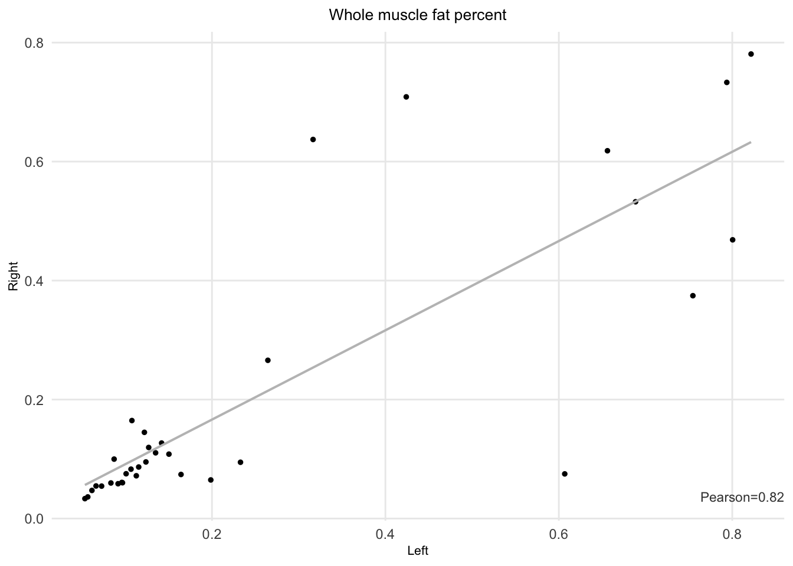
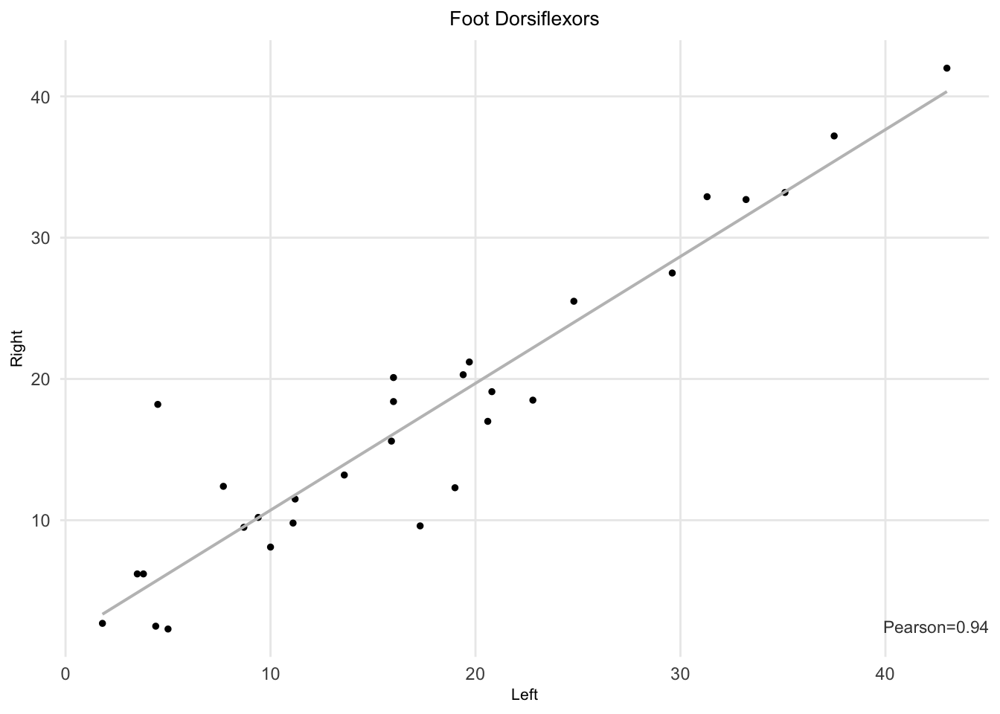
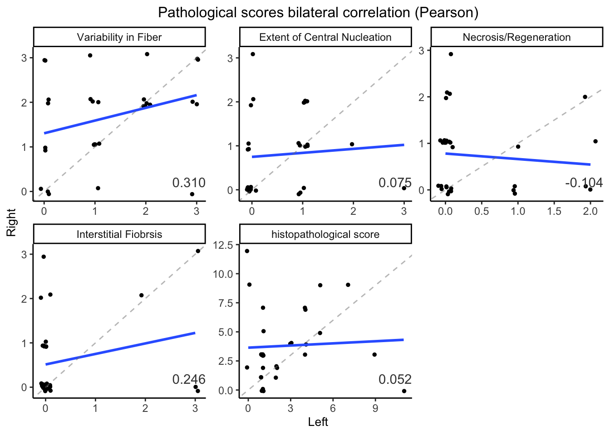
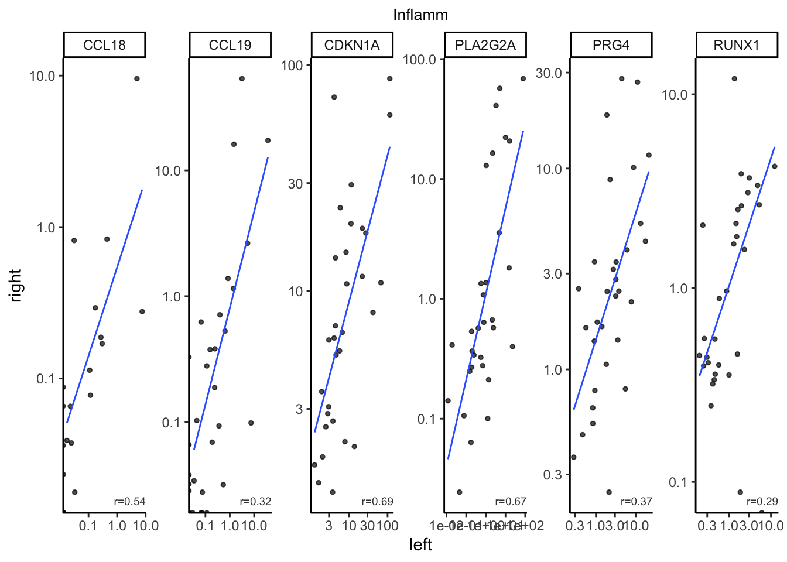
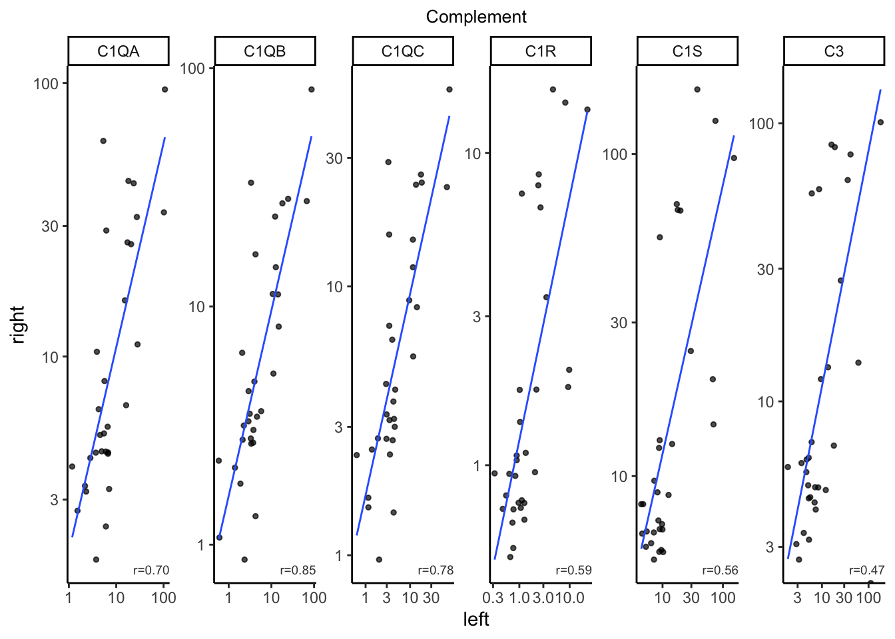

# Bilateral comparison {#bilateral-comparison}


## STIR pairs simulation


## Fat infiltration
The Pearson correlation between right and left fat infiltration is 0.82.

```
#> # A tibble: 1 × 1
#>     cor
#>   <dbl>
#> 1 0.821
```



## Muscle strength


## Comprehensive for other histopathological variables



## Baskets biolateral comparisons

### Per-gene correlation
We calculated the left-t-right correlation for every genes in the baskets. The unit of the expression here is TPM.
1. 


  
<table>
<caption>(\#tab:cor-and-mean-cor-per-gene-per-baksets)Mean of correlation of genes in each baskets calculated by TPM on L/R muscle.</caption>
 <thead>
  <tr>
   <th style="text-align:left;"> basket </th>
   <th style="text-align:right;"> cor_mean </th>
  </tr>
 </thead>
<tbody>
  <tr>
   <td style="text-align:left;"> DUX4-M6 </td>
   <td style="text-align:right;"> 0.6521460 </td>
  </tr>
  <tr>
   <td style="text-align:left;"> ECM </td>
   <td style="text-align:right;"> 0.5126943 </td>
  </tr>
  <tr>
   <td style="text-align:left;"> Inflamm </td>
   <td style="text-align:right;"> 0.4809635 </td>
  </tr>
  <tr>
   <td style="text-align:left;"> Complement </td>
   <td style="text-align:right;"> 0.6574381 </td>
  </tr>
  <tr>
   <td style="text-align:left;"> IG </td>
   <td style="text-align:right;"> 0.8281996 </td>
  </tr>
</tbody>
</table>


__Scatter plot for each genes__
6 by 5 scatter plots





### Per-basket by log sum
Here we calculate the per-basket bilateral correlation using basket scores.


